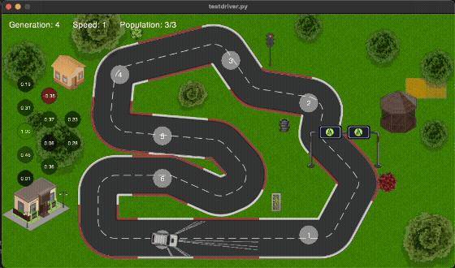

# Self-Driving Car Simulation  

## Overview  
LaneKeeper is a **self-driving car simulation** built in Python.  
It combines:  
- **Pyglet** for rendering & simulation.  
- **Neural Networks** for processing sensor data and controlling the car.  
- **Genetic Algorithm** for training and optimizing the neural network weights.  

---

## Demo  

---


## Features  
- Car simulation on custom tracks.  
- Neural network with **5 inputs, 4 hidden layers, 2 outputs**.  
- Genetic algorithm with **selection, crossover, and mutation**.  
- Training system that improves driving across generations.  
- Saves the **best weights in `brain.json`** for reuse on any track.  

---

## Project Structure  
```
│── images_/           # Assets (track, cars, UI, etc.)
│── brain.json         # Saved best weights (trained genes)
│── canvas.py          # Drawing / rendering helpers
│── car.py             # Car object & physics
│── evolution.py       # Genetic algorithm logic
│── hud.py             # HUD / stats display
│── network.py         # Neural network implementation
│── storage.py         # Save / load utilities
│── testdriver.py      # Run a car using saved brain.json
│── track.py           # Track & checkpoints
│── training.py        # Training loop (main entry)
│── requirements.txt   # Python dependencies
│── README.md
```

---

## Installation  
Clone the repository and install dependencies:  
```bash
git clone https://github.com/yousifnimah/Self-Driving-Car-Simulation-with-Neural-Networks-Genetic-Algorithm
cd Self-Driving-Car-Simulation-with-Neural-Networks-Genetic-Algorithm
pip install -r requirements.txt
```

---

## Usage  

### 1. Train the cars  
Run training mode (cars evolve using GA):  
```bash
python training.py
```

### 2. Test a trained model  
After training, the best weights are saved to `brain.json`.  
You can test the saved model with:  
```bash
python testdriver.py
```

## Future Work  
- More advanced tracks & obstacles.  
- Deep Reinforcement Learning integration.  
- Multi-agent driving.  

---

## Tags  
`#Python` `#AI` `#NeuralNetworks` `#GeneticAlgorithm` `#Pyglet` `#SelfDrivingCar`  
